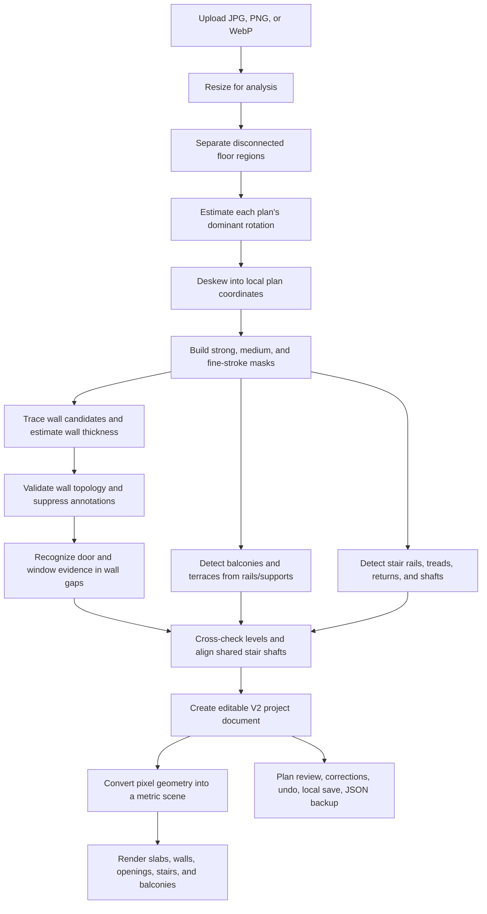

# Planform V2: Rules and Processing Mechanism

**Implementation covered:** `v2-geometry-bootstrap`  
**Runtime:** browser-based `geometry-fallback`  
**Report date:** 16 August 2026

## 1. Purpose and scope

Planform converts one ordinary floorplan image into an editable, multi-level structural proposal and then renders that proposal as an interactive 3D building. The current version runs its analysis in the browser. It does not send the uploaded image to a trained vision service.

This report describes the behavior that is implemented now. It distinguishes direct visual evidence from topology rules and from lower-confidence fallback inference. It also states the current limits instead of describing planned capabilities as if they already existed.

The central design rule is:

> The source image proposes structure; the canonical project document stores structure; the user remains able to correct the proposal.

There are no runtime rules tied to the coordinates, language, or room names of the validation residence. That residence is a regression fixture: it is used to verify general rules, but it is not recognized as a special case.

## 2. End-to-end flow

The analyser uses a local coordinate frame. “Horizontal” and “vertical” inside the detector mean the two principal directions of the floorplan after deskewing, not the axes of the uploaded photograph or screenshot.

## 3. Input and preprocessing rules

| Rule | Current behavior |
|---|---|
| Accepted files | JPEG, PNG, and WebP |
| Maximum file size | 20 MB |
| Analysis resolution | The longest side is reduced to at most 1,280 pixels; smaller images are not enlarged |
| Processing location | In the browser on the current device |
| Source preservation | A JPEG preview is stored with the project; a separate crop is used as each 3D floor texture |
| Analysis failure | The app returns a single low-confidence floor region so the review interface remains usable |

The 1,280-pixel limit balances mobile memory and speed against preservation of thin balcony rails, stair treads, and door arcs. A previous 900-pixel limit erased too many one-pixel signals in screenshots.

### Ink, colour, and the building envelope

Printed floorplans routinely draw structure in colour rather than black: tan or brown exterior walls, blue bathroom fills, olive hatching. Deciding "is this ink?" on luminance alone treats a mid-tone coloured wall as paper. The envelope test therefore accepts a pixel as ink when it is dark **or** clearly saturated and not near-white.

The building footprint is measured directly from that ink, not inferred from whichever wall segments the tracer accepted. This ordering matters more than it appears: every later stage is expressed relative to the footprint — the exterior-wall test that decides door versus window, balcony depth, stair plausibility, the room grid, and metric scale. A footprint derived from tracing collapses exactly when tracing fails, and then silently corrupts all of them. Two of the seven regression fixtures previously produced footprints a fraction of the true building, one of them a single pixel tall, while every test still passed.

The traced-wall bounds remain preferred, because they sit on wall centre lines rather than the outer edge of a stroke, and because ink legitimately spills past the building wherever a balcony rail, dimension chain, or caption is drawn. The ink envelope is used only as a rescue, when the traced footprint has visibly collapsed relative to the ink rather than merely being tighter than it.

### Paper and image bounds

For each proposed floor region, the analyser searches for rows containing a usable paper margin and rejects nearly solid dark rows such as phone or browser chrome. It then calculates an Otsu luminance threshold from the remaining pixels. This adapts the black/white cutoff to the contrast of each uploaded image.

Three related masks are retained:

- a strong dark mask for structural wall cores;
- a medium mask for thinner stair and door evidence;
- a more permissive fine-stroke mask for window lines and anti-aliased symbols.

Keeping separate masks prevents the system from having to choose between preserving thin symbols and accepting every annotation as a wall.

## 4. Separating multiple floorplans

Planform first identifies disconnected drawing regions before tracing their internal structure.

1. The image is summarized on a 56-column grid. The number of rows follows the image aspect ratio, with a minimum of 28.
2. A grid cell is occupied when more than 3.5% of its sampled pixels have luminance below 220.
3. Occupied cells are expanded by one neighboring cell in every direction. This joins small gaps caused by labels and openings.
4. Four-connected components are extracted.
5. Very small components are discarded. A main candidate needs at least 22 cells and a minimum grid size of 6 × 6.
6. A smaller nearby component can be attached to a larger plan when it is aligned, sufficiently close, and contains no more than 48% of the larger component's occupied cells. This is how a detached balcony rail or its label can remain part of its floor.
7. Similarly sized disconnected components remain separate levels.
8. When brochure text or a decorative building render creates extra components, centrally positioned plan-sized groups are preferred.
9. At most four plan regions are proposed from one image.

The initial list follows visual top-to-bottom, then left-to-right order. That page order is not treated as building height.

### Floor-order suggestion

For exactly two detected plans, if only one contains a detected exterior platform, Planform suggests that plan as the upper floor. This is supporting evidence based on the common meaning of a balcony; it is not a definitive rule. The app always asks for floor-order review and provides reorder, reverse, and rename controls.

## 5. Rotation-invariant local coordinates

The analyser does not require the uploaded floorplan to be aligned with the image axes.

### Dominant-orientation estimate

For each floor region, the detector:

1. collects supported dark pixels while suppressing isolated anti-alias and text pixels;
2. evaluates candidate rotations from −44° through +45°;
3. at each angle, measures repeated pixel support in two perpendicular directions;
4. tests three distances proportional to the plan size, so long wall continuity contributes more than short text strokes;
5. selects the angle with the strongest combined support.

The analyser keeps the original orientation when the preferred correction is no more than 1°, or when the best rotated score improves on the unrotated score by no more than 4.5%. This prevents unnecessary resampling of an already aligned drawing.

### Deskewing

When correction is needed, the floor region is rotated into its local frame before structure detection. The sampler preserves the darkest of the four neighboring source pixels. This deliberately protects one-pixel door arcs, stair treads, and rails that normal bilinear filtering can erase.

Detected geometry stays in the deskewed frame for 3D generation. The plan-review overlay applies the inverse transformation so the colored result appears over the correct lines in the original image. The 3D floor texture is also deskewed before cropping.

### Important boundary

This solves a globally rotated rectilinear floorplan. The current wall tracer still assumes that most walls belong to two perpendicular principal directions. A plan may be rotated on the page, but a building containing substantial diagonal, curved, or several unrelated wall directions is not yet fully supported. Perspective distortion from an oblique photograph is also not rectified.

## 6. Wall detection

Walls are not defined simply as any dark line. The detector combines stroke width, continuity, and connections to other structural strokes.

### Candidate extraction

1. Long dark runs are traced in both local principal directions.
2. The minimum run is 6% of the smaller floor-region dimension, with an absolute minimum of 12 pixels.
3. Connected run components must be elongated: length must be at least 2.2 times thickness.
4. Components are split where their full cross-section lacks dark support. This prevents a thin dimension line attached to a wall from inheriting the wall's entire length.
5. Nearby collinear components are merged.
6. The typical wall thickness is estimated as a length-weighted 66th percentile of sufficiently long strokes. It is constrained to a sensible range relative to the plan size.

### Structural validation

A candidate is retained when it has adequate thickness and density and at least one of the following applies:

- it is long relative to the plan;
- it connects to a perpendicular structural segment;
- it is a thick short fragment at a structural junction;
- it forms a collinear pair across a plausible door-sized gap.

The last rule is important for doors: a wall interrupted by a doorway remains one structural boundary rather than becoming two unrelated fragments. This is how the entrance-hallway/master-bedroom boundary in the validation plan is preserved.

### Wall-anchor recovery

Segments on the same local line are grouped. The analyser rescans the full cross-section to recover solid wall anchors that may have been split by a door, a window, compression, or anti-aliasing. Exterior lines receive slightly broader recovery because their openings often divide a façade into several pieces.

### Suppression of false walls

Thin annotations can be collinear with a real wall. The detector therefore measures perpendicular thickness along the final wall proposal. It may trim one unsupported tail when all of these conditions are met:

- the wall is internal;
- it contains no recognized opening;
- one end has consistent thick support and the other does not;
- the retained end terminates at another structural wall;
- the remaining segment is still substantial.

This prevents a dimension line from becoming the false wall between the living room and kitchen, while avoiding broad deletion of legitimate faint walls.

### Light-tier partitions

The rules above describe the **heavy tier**, built from the strong-threshold mask. Many drawings use a visibly thinner line weight for interior partitions than for exterior walls; a single global thickness threshold sized for the heavy tier can reject those partitions outright before density or length rules ever run.

A second **light tier** is extracted from the fainter medium mask and validated by a different rule: instead of length and density alone, a light candidate must be topologically *anchored* — both of its endpoints must terminate at an already-accepted wall (heavy or light) or at the footprint edge, within a small tolerance. This runs in several passes so a chain of thin partitions can bootstrap off one heavy wall or footprint edge, one T-junction at a time. Furniture and text strokes normally fail this test because they do not terminate at a perpendicular structural line.

Before a light candidate is even considered, it is checked against dimension-chain evidence: a thin, near-solid straight run that carries a short perpendicular witness tick somewhere in its *middle* — not just at its two ends, the way a real wall's T or L junctions do — is rejected as an annotation rather than admitted as a wall. Without this check, a dimension line spanning wall-to-wall satisfies the same endpoint-anchoring rule a real partition would.

Every detected wall carries a `weight` of `heavy` or `light`, which the 3D viewer uses to render partitions thinner than load-bearing walls.

## 7. Doors and windows

Openings start as bounded gaps between collinear structural wall sections. Classification then uses evidence inside and around the gap.

### Swing-door symbol recognition

The primary door rule recognizes the conventional hinge–leaf–arc glyph.

For every candidate gap, the analyser tests:

- either end of the gap as the hinge;
- either side of the wall as the opening side;
- door-leaf angles from 55° to 105°;
- swing-arc radii of 84%, 92%, and 100% of the gap width.

It samples two independent features:

1. a straight radial door leaf from the proposed hinge;
2. a curved swing trace from the closed direction toward that leaf.

Both must be present. The score uses their joint support so that a nearby table edge alone, or an isolated curve alone, cannot become a high-confidence door. A symbol-supported door requires a combined score of at least 0.46, leaf support of at least 0.42, and arc support of at least 0.34.

The detected opening records its evidence source:

| Evidence value | Meaning |
|---|---|
| `symbol` | The leaf and swing arc jointly support a door |
| `geometry` | Stroke geometry supports a window or a less complete door |
| `context` | A bounded internal gap has weaker supporting marks and is treated as a lower-confidence door |

The balcony-center exception has been removed. An opening does not become a door merely because it is close to the middle of a balcony. The validation plan has an automated regression assertion requiring its balcony door to carry `symbol` evidence.

### Window symbol recognition

A drawn window is normally two, sometimes three, parallel glazing lines running the full width of the gap, close to the wall face. A door's swing arc can pass through the same fainter mask used for window evidence, but a curve only crosses any single offset from the wall briefly, while true glazing lines hold a near-solid density at a fixed offset across almost the entire gap.

The detector samples density at every offset out to about 2.5× the wall thickness on each side of the gap and looks for two near-solid peaks (density ≥ 0.82) a plausible glazing separation apart. When found on an exterior wall, this is decisive window evidence and overrides a marginal door-symbol reading, unless the door score is itself almost certain. This is what keeps a real swing door — whose arc never forms that tight parallel pair — safe, while reclassifying glazing lines that a cruder "any dark pixels near the gap" check had previously read as low-confidence doors.

### Windows (parallel-line fallback)

Window evidence is also based on one or more thin lines running parallel to a gap in an exterior wall, using a wider and less specific search than the symbol test above. Strong parallel support on a façade is classified as a window. Interior-wall gaps are biased away from windows because windows are uncommon inside ordinary residential partitions, and closet shelving can draw a similar parallel pair.

### Fallback behavior

Incomplete scans may erase part of a door arc. A bounded internal gap can still receive lower-confidence `context` classification when it contains partial perpendicular, curved, or parallel stroke evidence. This fallback is deliberately capped below strong symbol confidence and remains reviewable.

## 8. Balconies and terraces

Outdoor areas are detected geometrically; the analyser does not require words such as “Altan,” “Balcony,” or “Terrace.”

For each side of the local building footprint, the detector searches for:

- a rail outside the façade at a depth between 10% and 62% of the corresponding footprint dimension;
- rail overlap of at least 44% with the building edge;
- at least two roughly perpendicular side supports;
- a supported platform span of at least 40% of the corresponding building dimension.

Up to two highest-confidence outdoor areas are retained. In 3D, pixel evidence determines the platform span and depth, while a geometric constraint attaches the platform to the corresponding slab edge. The renderer adds a platform, guard panels, rails, and posts; it does not remove the detected balcony from the building model.

## 9. Stairs and cross-floor alignment

### Stair-symbol detection

The analyser searches for paired thin rails or stringers with repeated cross-strokes:

- plausible rail lengths are proportional to the plan size;
- paired rails must be parallel, separated by 6.5% to 31% of the smaller plan dimension, and overlap sufficiently;
- the run length must be plausible relative to rail separation;
- the candidate must lie in or immediately beside the building footprint;
- at least two repeated cross-strokes must be found;
- estimated step count is constrained to 5–16, and candidates with fewer than 6 final steps are rejected;
- oversized candidates are rejected relative to both the shaft and full footprint.

When regular treads identify only one flight of a half-turn stair, nearby connected return-flight or winder evidence can expand the detected shaft sideways. Solid wall columns are excluded from this expansion.

At most two non-duplicate stair candidates are retained per floor.

### Shared shaft alignment

Adjacent plans describe the same physical stair shaft with different linework. Once floor order is known, Planform:

1. selects the highest-confidence upper-floor stair;
2. compares it with lower-floor candidates in normalized footprint coordinates;
3. requires the same local run direction;
4. accepts the closest candidate only when normalized center distance is at most 0.22;
5. projects the upper-floor shaft box onto the lower floor.

The upper plan is used because the slab opening is usually clearest there. This prevents the two levels from producing laterally shifted stair holes.

### Half-paced stair construction in 3D

For a matched pair, the 3D generator creates:

- a lower flight from the lower slab to half the inter-floor elevation;
- a landing at half height;
- an upper flight in the opposite lane from the landing to the upper slab;
- a rectangular opening cut into the upper slab.

The final upper tread is constrained to meet the upper slab edge. Both flights and the landing are constrained inside the detected shaft opening. This is a generated half-paced representation; the analyser does not yet reconstruct every individual winder or stair construction type from first principles.

## 10. Room estimation and confidence

Rooms are a topology estimate, not semantic room recognition. Walls are rasterized onto a 72 × 72 grid, the outer border is closed, and flood fill finds sufficiently large enclosed empty components. An opening never closes the wall rasterization, so a doorway does not merge two rooms into one. Tiny enclosed artifacts are ignored.

Each enclosed component is reported as a room entity with the bounding box of its cells as its shape. This is exact for the rectangular rooms typical of a residential plan; an L-shaped room is reported as a box that extends past its true footprint, since the analyser does not yet trace an exact rectilinear outline. Room count is `rooms.length`.

The overall structure confidence starts from a base score and gains support from:

- number of walls;
- wall-to-wall topology connections;
- recognized openings;
- an exterior area;
- a stair candidate.

The score is capped at 0.94. Individual wall confidence depends on length and thickness. Walls below 0.70 create review warnings. A multi-level project also warns when stairs are absent, floor order has not been confirmed, or real-world scale has not been supplied.

Confidence is evidence strength, not a statistical probability calibrated on a large labeled dataset.

## 11. Conversion into the 3D scene

The canonical project stores walls and openings, not prebuilt meshes. Meshes are derived when the viewer renders.

### Scale resolution hierarchy

Every level in a project shares one project-wide `metresPerPixel` ratio: two floors of the same building are the same physical size, so they must not be scaled independently. Scale is resolved in order:

1. **User measurement.** The user selects a detected wall, presses Measure, and enters its real length. This always wins and is recorded as `source: "user"` with full confidence.
2. **Door-width estimate.** When at least two symbol-confirmed door openings exist, the analyser takes their median pixel width and calibrates against 0.89 m — a representative Danish interior door clear width — subject to a sanity check that every level's resulting footprint falls between 2.5 m and 40 m per side. This is recorded as `source: "door-width"` at moderate confidence (0.4–0.7) and is always presented as an estimate, never as a measurement.
3. **Provisional fallback.** When neither is available, each level is independently scaled to a nominal 10-metre width, exactly as before. This keeps the model navigable but is not comparable across levels and is recorded as `source: "provisional"`.

Reading the dimension text itself (OCR) is not yet implemented; the dimension-chain detection added to reject false walls (§6) and false door/window evidence intentionally recognizes chains without reading their digits, so this is the natural next source to slot into the hierarchy above the door-width estimate.

With a resolved scale, the conversion uses:

- floor-to-floor elevation: 3.05 metres;
- ceiling height: 2.70 metres on the base level and 2.55 metres above;
- door height: 2.12 metres;
- window height: 1.30 metres with a 0.90-metre sill;
- wall thickness: detected pixel thickness converted and constrained to 0.10–0.42 metres for heavy walls, 0.05–0.42 metres for light partitions.

Every level still receives a `scale-needed` issue while the scale source is `door-width` or `provisional`, downgraded to informational once a door-width estimate is available, so an estimate is never silently presented as a measurement.

### Derived geometry

- A wall becomes oriented boxes split around each opening.
- A door leaves a full-height passage below its header.
- A window receives a sill, header, and translucent glass panel.
- The upper slab is split into four pieces around a stairwell opening.
- The source crop is mapped over the floor pieces with matching texture coordinates.
- Outdoor spaces extend the viewer's framing bounds.
- Wall cutaway clips every wall at a section height, revealing the interior without changing the canonical structure. It is a section cut rather than a transparency fade: walls are near-white on a near-white ground, so lowering their alpha cannot actually reveal what is behind them — it only removes their shadow, which is what the earlier "wall opacity" control did.
- Exploded view changes display separation but not stored floor elevations.

## 12. Review, correction, and persistence

The analyser produces a proposal rather than silently claiming certainty. Current user controls include:

- select and remove a detected wall;
- add a door or window to a selected wall;
- remove, move, resize, or retype an existing opening;
- enter a real measurement for a selected wall to resolve project scale;
- undo the last structural edit;
- rename and reorder levels;
- reverse the full level order;
- expand or shrink a source region;
- realign adjacent stairs;
- change wall opacity and visible levels;
- switch between plan review, 3D, and exploded views.

Manual opening addition places a new opening in the middle of the selected wall. Its width is proportional to wall length and differs for doors and windows. Editing an existing opening's position, width, or door/window kind directly is available as a document-level correction (`move-opening`, `resize-opening`, `set-opening-kind`, `remove-opening`); the plan-review canvas currently exposes this as a wall-and-opening selection flow rather than free-form dragging, which remains a follow-up.

Projects use schema version 2 and keep the source metadata, detected structure, confidence, issues, edit history, project scale, and preview. They are saved to the browser's IndexedDB database after a 220 ms debounce. The newest local project can be continued on the same browser and device. Projects can also be exported and imported as `.planform.json` files. A project saved before scale calibration was added is treated as provisional scale on load rather than rejected.

Re-analysis is not automatically applied to an already saved project. To use a newer detector version, the user must upload and analyse the source image again. Local browser storage is not cross-device cloud storage.

## 13. Regression and validation rules

The repository tests the detector at several levels:

- floor-region grouping, balcony attachment, and visual-order correction;
- synthetic thick walls, door arcs, false dimension lines, and half-paced stairs;
- seven user-supplied floorplan fixtures when the private local corpus is present;
- the two-floor validation residence, including balcony, stairs, balcony door, bedroom partition, and absence of the false living-room/kitchen wall;
- the validation residence rotated by 9°;
- a synthetic swing-door plan rotated by 11°;
- V2 document edits, undo, serialization, and floor ordering;
- the complete GitHub Pages production build.

The private floorplan images are excluded from the deployed site and public repository. Their manifest explicitly states that they are not approved for model training or public redistribution.

### Test resolution must match the app

The fixture tests analyse at the same 1,280-pixel limit the app uses. They previously ran at 720, and the detector's thresholds are resolution-sensitive enough that this changed its behaviour qualitatively rather than marginally: at 720 the brochure fixture produced a plausible footprint, while at the app's own 1,280 the same fixture collapsed to a footprint one pixel tall. The whole suite was green against a configuration that never shipped. Any future change to the analysis resolution in `app/page.tsx` must be mirrored here.

## 14. Current limitations

The main limitations of the current implementation are:

1. **No trained semantic model.** Detection is classical image geometry and topology, not learned wall, door, furniture, or room segmentation.
2. **Two dominant directions.** Global plan rotation is supported, but arbitrary diagonal and curved wall networks are not fully vectorized.
3. **No perspective correction.** Screenshots and flat scans work best; oblique photographs may distort topology.
4. **No OCR yet.** Dimension text and room labels are not read; scale falls back to a door-width estimate or a provisional per-level default rather than the printed measurement. Digits in a compressed or low-resolution upload can be only a few pixels tall and unreadable in any case.
5. **Furniture and fixtures remain texture detail.** Tables, cupboards, toilets, sinks, and similar objects are visible on the floor texture but are not separate 3D entities.
6. **Image-only intake.** The current UI accepts JPEG, PNG, and WebP, not PDF.
7. **Thin or damaged symbols can be missed.** Compression, blur, overlaid UI, or aggressive downsampling may erase a door arc, balcony rail, or stair tread. A non-black or curved exterior wall (a rendered brochure elevation rather than a plain line drawing) is not yet traced at all.
8. **Room shape is a bounding box.** A rectangular room's box is exact; an L-shaped room's box extends past its true footprint, since the analyser does not yet trace an exact outline.
9. **Local persistence only.** IndexedDB projects do not automatically appear on another phone or computer.
10. **Generated stair archetype.** The 3D connection is a reliable half-paced representation for the current validation case, not a complete catalogue of stair types.
11. **Correction is opening- and wall-selection based, not free-form drawing.** Moving a wall's endpoint or drawing a brand-new wall is not yet supported; the corrections available today are removing/adding/retyping/repositioning openings and removing a wall.
12. **Interior partitions are still under-detected.** The light tier described in §6 recovers some thin partitions but is a stopgap: it decides by stroke thickness and endpoint proximity, which is a proxy for the real question. A wall is defined by dividing space, so the correct test is functional — does removing this line merge two otherwise separate regions of free space? On the two-floor validation residence the light tier recovers no additional partitions at all, and several small rooms remain unenclosed. Replacing thickness heuristics with that space-division test, and deriving rooms from the resulting partition of free space rather than by re-rasterising walls onto a 72 × 72 grid, is the next substantial accuracy step.

## 15. Evidence hierarchy and future direction

The current decision hierarchy is:

1. direct symbol or stroke evidence;
2. wall continuity and structural topology;
3. cross-floor consistency;
4. constrained contextual fallback;
5. explicit user correction.

The next major accuracy step is not adding more case-specific coordinates. It is combining the current geometric validator with a trained semantic segmentation model, arbitrary-angle vector tracing, OCR-assisted scale extraction, and confidence calibration on a larger labeled corpus. The geometry layer should remain as an independent validator because it can reject semantically plausible but structurally impossible predictions.

## 16. Code map

| Area | Main implementation |
|---|---|
| Upload, analysis orchestration, review UI | `app/page.tsx` |
| Multi-floor region separation | `app/plan-regions.ts` |
| Rotation, walls (heavy/light tiers), openings, dimension-chain rejection, balconies, stairs, rooms | `app/structure-detector.ts` |
| Door-width scale estimation | `app/structure-detector.ts` → `resolveScaleFromDoors` |
| Canonical V2 project, issues, edits, undo, project scale | `app/floorplan-document.ts` |
| Pixel-to-scene conversion | `app/structure-detector.ts` → `structureToLevel` |
| Stair opening and half-paced connections | `app/scene-geometry.ts` |
| Three.js rendering | `app/twin-viewer.tsx` |
| IndexedDB and JSON import/export | `app/project-storage.ts` |
| Regression fixtures and structural assertions | `tests/floorplan-fixtures.test.mjs`, `tests/structure-detector.test.mjs` |
| Ground-truth-free detector benchmark and debug overlay | `tests/benchmark/score.mjs`, `tests/benchmark/render-overlay.mjs` |

